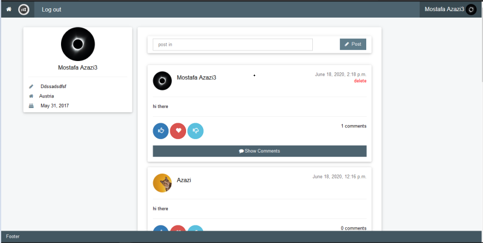
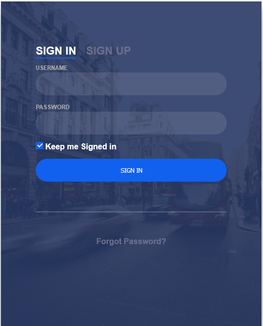
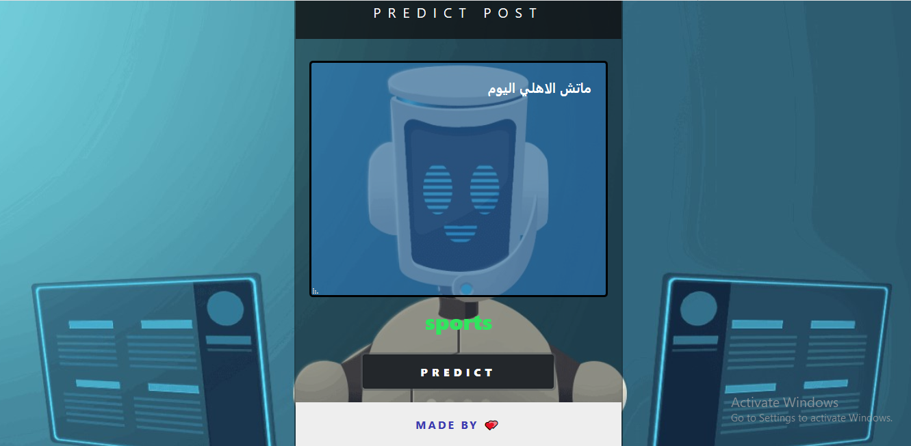

# Project Title

 * Social media Network
 
---
### Table of Contents

In this section you will know More bout this interesting project :smiley:

- [overview](#overview)
- [An_open_source_Social_Network](#An_open_source_Social_Network)
- [Current_Features](#Current_Features)
- [Ai_model_on_heroku](#Ai_model_on_heroku)
- [Homepage](#Home_page)
- [user_profile](#user_profile)
- [error_when_try_to_publish_empty_post](#error_when_try_to_publish_empty_post)
- [recommendation_using_Ai ](#recommendation_using_Ai )

---

### overview

 The idea of the project is summarized in how to make classify posts and determine which is spam or not and if spam, this post must be
 discarded else insert post in database Ai model run on database and use it to classify post, Make frontend form where each user can 
 post in it and pass this post to ai model to classify it , and determine number of like in this post 
 
 * Main goal of this project
 
      To avoid posting fake and not important posts
 
 
---

#### An_open_source_Social_Network

Used Tech Stack

1. Django
2. Mysql database
3. Web Socket (Django Channel)
4. Workbensh
---

### Current_Features:

1. Login/Register

2. Create post and comment on the particular post

3. Receive love when someone comment on your post

4. recommendation when user publish post 

5. see when someone comment on post

5. Natural language processing on posts to analyze it using arabic posts

---

## sign in form 

User must has an account, supplying the following data:

- Email

- Password

Searching in database if email & password exists, the second form must be opened If not, display a message to allow a new user to sign up  New user may click sign up, the sign up form must be opened

 

---

## Homepage

* we use this design in frontend using bootstrap to make social media responsive 

---

## user_profile

## error_when_try_to_publish_empty_post

## recommendation_using_Ai 

---

### Ai_model_on_heroku

* Ai model we deploy it on heroku to try model 

 

 

[link heroku](https://posts-classification.herokuapp.com/)

Show your support by 🌟 the project!!
